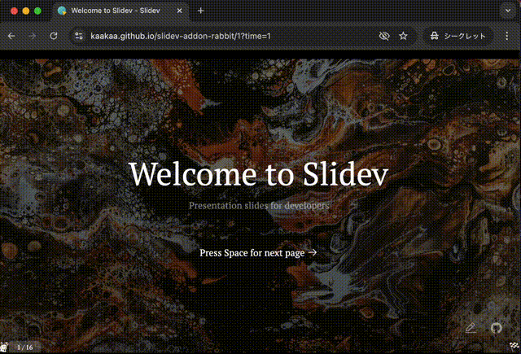
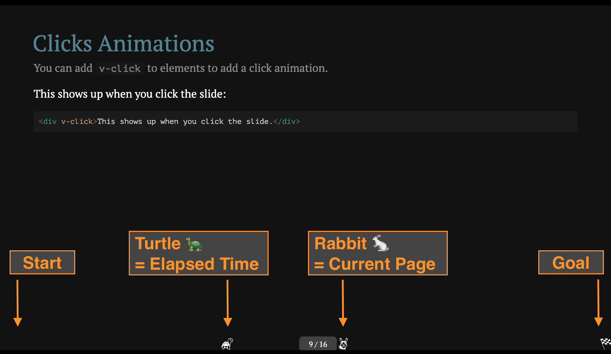

[](https://www.npmjs.com/package/slidev-addon-rabbit)
# slidev-addon-rabbit

Presentation time management for slidev inspired by [rabbit\-shocker/rabbit](https://github.com/rabbit-shocker/rabbit/) | [Rabbit \- はじめに](https://rabbit-shocker.org/ja/)

# Demo

https://kaakaa.github.io/slidev-addon-rabbit/1?time=1



## Description

As the presentation begins, the rabbit and the turtle aim for the goal. **The rabbit** represents **the current page**, and **the turtle** represents **the elapsed time** since the start. Let's guide the rabbit to the goal before the turtle arrives, ensuring everyone has enough leisure time.



## Usage

1. Apply `slidev-addon-rabbit` to your slidev project
   - See [Use Addon \| Slidev](https://sli.dev/addons/use.html)
2. Run slidev (e.g.: `npm run dev`)
3. Either:
   - Attach url query `?time=10` to presentation url, and access it (e.g.: `http://localhost:3030/?time=10`), OR
   - Use slide time attributes with `useSlideTimes: true` (see below) - no query parameter needed in this case

### Using Slide Time Attributes

You can specify time budgets for individual slides by adding a `slideTime` attribute to each slide's frontmatter. The time value should be in minutes.

```md
---
title: My First Slide
slideTime: 2  # This slide has a time budget of 2 minutes
---

# My Presentation

---
title: Complex Topic
slideTime: 5  # This slide has a time budget of 5 minutes
---

# Complex Topic
```

To enable time-based slide tracking, add the `useSlideTimes: true` option to your rabbit configuration:

```yaml
---
addons:
  - slidev-addon-rabbit
rabbit:
  slideNum: true
  useSlideTimes: true  # Enable time-based slide tracking
---
```

When `useSlideTimes` is enabled:

- The **flag** represents the total presentation time (sum of all slide time budgets)
- The **rabbit** represents the cumulative time budget up to the current slide
- The **turtle** represents the actual elapsed time since presentation start
- **No time query parameter is needed** in the URL - the plugin will automatically use the time values from your slides

> Note: If no time attributes are found in the frontmatter, the addon will fall back to the standard slide-count-based positioning.

## Configs

```yaml
---
...
addons:
  - slidev-addon-rabbit
rabbit:
  slideNum: true   # Show current/total slide numbers next to a rabbit icon
  useSlideTimes: false  # Set to true to enable time-based slide tracking (default: false)
...
---
```

# License

This repository distributes under [MIT License](./LICENSE)

Icons used in this slide are distributed from [Emoji One \(Monotone\)](https://icon-sets.iconify.design/emojione-monotone/) under [CC BY 4.0](https://creativecommons.org/licenses/by/4.0/deed.ja).

